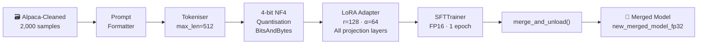
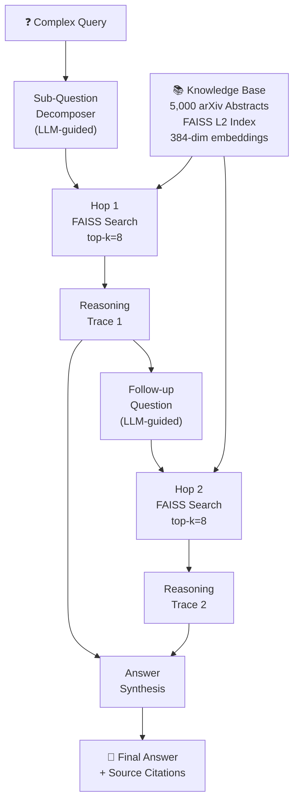
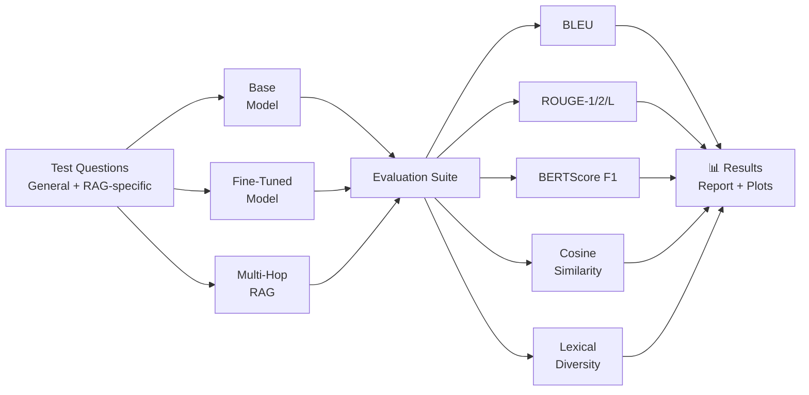

# 🔬 QLoRA Fine-Tuning + Multi-Hop RAG Pipeline

[](https://www.python.org/)
[](https://pytorch.org/)
[](https://huggingface.co/docs/transformers)
[](https://github.com/huggingface/peft)
[](LICENSE)

> An end-to-end NLP system that combines **QLoRA instruction fine-tuning** of a 1.5B-parameter LLM with a **multi-hop Retrieval-Augmented Generation (RAG)** pipeline, evaluated across BLEU, ROUGE, BERTScore, and semantic similarity metrics.

---

## 📌 Overview

This project explores two complementary approaches to improving LLM response quality — **parameter-efficient fine-tuning** and **retrieval-augmented generation** — and rigorously compares them through a three-way evaluation framework.

| Component | What it does |
|---|---|
| **QLoRA Fine-Tuning** | Instruction-tunes `DeepSeek-R1-Distill-Qwen-1.5B` on 2,000 Alpaca samples using 4-bit NF4 quantisation |
| **Multi-Hop RAG** | Decomposes complex queries into sub-questions, retrieves over 5,000 arXiv abstracts via FAISS, and synthesises answers iteratively |
| **Evaluation Framework** | Three-way comparison (Base vs Fine-Tuned vs RAG) using BLEU, ROUGE-1/2/L, BERTScore F1, cosine similarity, and lexical diversity |
| **Gradio Demo** | Interactive chat interface with source attribution and inference timing |

---

## 🏗️ Architecture

### 1. Fine-Tuning Pipeline



### 2. Multi-Hop RAG Pipeline



### 3. Evaluation Framework



---

## 📁 Project Structure

```
qlora-multihop-rag/
│
├── notebooks/
│   └── qlora_multihop_rag.ipynb      # Full end-to-end notebook (Colab-ready)
│
├── src/
│   ├── finetune.py                   # QLoRA fine-tuning pipeline
│   ├── rag_pipeline.py               # Multi-hop RAG controller
│   ├── evaluate.py                   # Evaluation framework
│   └── app.py                        # Gradio chat interface
│
├── configs/
│   └── training_config.py            # Centralised hyperparameters
│
├── requirements.txt
├── .gitignore
└── README.md
```

---

## ⚙️ Installation

```bash
# Clone the repository
git clone https://github.com/<your-username>/qlora-multihop-rag.git
cd qlora-multihop-rag

# Install dependencies
pip install -r requirements.txt
```

> **GPU Note:** Fine-tuning requires a CUDA GPU. The configuration targets **6 GB VRAM** (tested on NVIDIA GTX 1660 Super and Google Colab T4). Inference and RAG evaluation can run on CPU with reduced speed.

---

## 🚀 Usage

### Step 1 — Fine-Tune the Base Model

```python
from src.finetune import run_finetuning
from configs.training_config import FinetuneConfig

config = FinetuneConfig()
run_finetuning(config)
# Saves merged model to: ./new_merged_model_fp32
```

### Step 2 — Build the FAISS Knowledge Base

```python
from src.rag_pipeline import build_index

build_index(
    dataset_name="gfissore/arxiv-abstracts-2021",
    num_samples=5000,
    index_path="arxiv_abstracts.faiss",
    docs_path="rag_documents"
)
```

### Step 3 — Run Multi-Hop RAG

```python
from src.rag_pipeline import RAGPipeline

pipeline = RAGPipeline(
    model_path="./new_merged_model_fp32",
    index_path="arxiv_abstracts.faiss",
    docs_path="rag_documents"
)

answer, contexts, subquestions, trace = pipeline.query(
    "What is the significance of QLoRA in fine-tuning large language models?",
    hops=2,
    k=8
)

print(answer)
```

### Step 4 — Evaluate All Three Systems

```python
from src.evaluate import run_comparison

results, metrics = run_comparison(pipeline)
# Outputs: metrics table + bar chart + box plots
```

### Step 5 — Launch Gradio Demo

```bash
python src/app.py
# Opens at http://localhost:7860
```

---

## 📊 Evaluation Metrics

The evaluation suite benchmarks three model configurations across four question types:

| Metric | Description | Target |
|---|---|---|
| **BLEU** | N-gram precision vs fine-tuned reference | Higher → more faithful phrasing |
| **ROUGE-1/2/L** | Recall-oriented overlap | Higher → better content coverage |
| **BERTScore F1** | Contextual semantic similarity | Higher → deeper meaning preservation |
| **Cosine Similarity** | Embedding-space groundedness in retrieved docs | Higher → better context utilisation |
| **Lexical Diversity** | Type-token ratio of responses | Balanced → fluent, non-repetitive output |

---

## 🧪 Key Design Decisions

**Why QLoRA over full fine-tuning?**
4-bit NF4 quantisation with LoRA adapters reduces GPU memory from ~12 GB to ~4.5 GB while preserving 95–98% of full fine-tune quality, making it accessible on consumer hardware.

**Why LoRA rank r=128?**
Higher rank captures more task-specific directions in weight space. With only 2,000 training samples, r=128 with α=64 provides sufficient capacity without overfitting.

**Why multi-hop RAG over single-pass?**
Single retrieval often misses bridging information needed for complex queries. Iterative sub-question decomposition ensures evidence is gathered across multiple reasoning steps before synthesis.

**Why arXiv abstracts as the knowledge base?**
Abstracts provide dense, factual NLP/ML domain knowledge in a compact form — ideal for testing model groundedness on technical questions.

---

## 🛠️ Tech Stack

| Category | Tools |
|---|---|
| **LLM** | DeepSeek-R1-Distill-Qwen-1.5B |
| **Fine-Tuning** | PEFT (LoRA), TRL (SFTTrainer), BitsAndBytes (4-bit NF4) |
| **RAG** | FAISS, Sentence-Transformers (`all-MiniLM-L6-v2`) |
| **Evaluation** | `evaluate` (BLEU, ROUGE), `bert_score`, Sentence-Transformers |
| **Interface** | Gradio |
| **Framework** | PyTorch, HuggingFace Transformers, Datasets, Accelerate |

---

## 🔮 Future Work

- [ ] Extend knowledge base with domain-specific corpora (e.g. financial reports, regulatory documents)
- [ ] Add re-ranking step (cross-encoder) between FAISS retrieval and synthesis
- [ ] Implement streaming inference for lower perceived latency in the Gradio UI
- [ ] Benchmark against RAG-only (no fine-tuning) and fine-tune-only (no retrieval) baselines more comprehensively
- [ ] Add LangChain / LangGraph orchestration layer for production deployment

---

## 📚 References

- [QLoRA: Efficient Finetuning of Quantized LLMs](https://arxiv.org/abs/2305.14314) — Dettmers et al., 2023
- [PEFT: Parameter-Efficient Fine-Tuning](https://github.com/huggingface/peft) — HuggingFace
- [Retrieval-Augmented Generation for Knowledge-Intensive NLP Tasks](https://arxiv.org/abs/2005.11401) — Lewis et al., 2020
- [DeepSeek-R1](https://huggingface.co/deepseek-ai/DeepSeek-R1-Distill-Qwen-1.5B) — DeepSeek AI
- [Alpaca-Cleaned Dataset](https://huggingface.co/datasets/yahma/alpaca-cleaned) — yahma

---

## 📄 License

MIT License — see [LICENSE](LICENSE) for details.

---

*Developed as coursework for the Neural Systems and Natural Language Processing module — MSc Artificial Intelligence, De Montfort University.*
